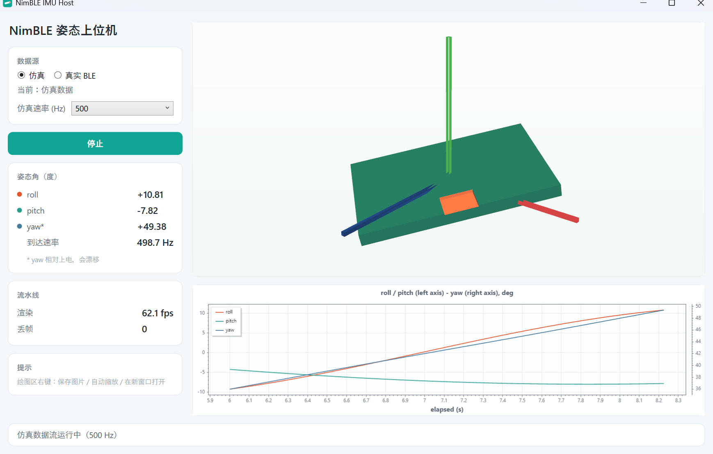
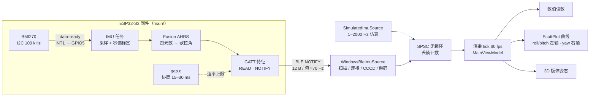

<div align="center">

# NimBLE_GATT_Server

**ESP32-S3 姿态采集端 + Windows 可视化上位机**

BMI270 六轴 IMU → Fusion AHRS 解算 → BLE NOTIFY 推送 → WPF 实时曲线 / 3D 姿态

<br/>


</div>

---

## 这是什么

一块 ESP32-S3 开发板（16 MB Flash / 8 MB PSRAM）读取板载 **BMI270 六轴 IMU**，用
[xioTechnologies Fusion](https://github.com/xioTechnologies/Fusion)（vendored 到 `main/fusion/`）
解算出 **roll / pitch / yaw**，通过一个自定义 BLE 特征以 **NOTIFY** 推给客户端；
仓库内 `host/` 是配套的 **Windows 上位机**（.NET 8 WPF），把收到的角度画成数值 + 实时曲线 + 3D 板体姿态，
最终打成**免安装单文件 exe**。

固件与上位机**都已在真机验证**（固件 2026-09-22，上位机 BLE 链路与发布产物 2026-09-23 / 2026-10-02）。



> 上报速率**由 BLE 连接间隔决定**，不是固件里的限速常量。`gap.c` 主动协商 15–30 ms + `latency=0`，
> 真机实测 **71.6 Hz、零丢包**（详见 [docs/host-integration.md](docs/host-integration.md) §8）。

## 核心特性

| 能力 | 说明 |
|---|---|
| 🎯 **姿态解算** | Fusion AHRS（四元数 + 独立零偏估计器）。静止抖动 roll/pitch **0.026° / 0.031° std**，yaw **0.010° std**；摇晃时抗线性加速度比纯加速度计好约 3 倍 |
| ⚡ **中断采样** | BMI270 data-ready → GPIO5，采样节拍由硬件中断驱动，不靠轮询 |
| 📡 **纯 NOTIFY 链路** | 12 字节 / 包（3 × `float32` 小端，单位度），无校验和、无帧序号，帧定界交给 BLE 层 |
| 🧪 **无硬件仿真模式** | 上位机内置 1–2000 Hz 可调仿真源，没有板子也能演示与压测 |
| 🚀 **≥100 fps 吞吐** | 采集/渲染解耦（SPSC 无锁环 + 60 fps 渲染 tick 拉取），仿真 500 Hz 到达 498.7 Hz、丢帧 **0** |
| 🤖 **无人值守 UI 验收** | `capture-ui.ps1` 用 UI Automation 驱动真实界面、自截图、判定读数冻结，不需要人坐在屏幕前 |
| 📦 **单文件交付** | 自包含 + 压缩，`publish/NimBleImuHost.exe` 81.6 MB，目标机器无需预装 .NET |
| 🔗 **零配对** | 无 PIN、无绑定，扫描 → 连接 → 写 CCCD 订阅即出数 |

## 系统架构



**热路径纪律**：BLE 回调线程只做「解码 + 写环」，任何 UI/统计都在渲染 tick 里拉取——这是 500 Hz 压测丢帧为 0 的原因
（设计依据见 [docs/host-app.md](docs/host-app.md) §2.5）。

## 快速开始

### 环境前提

| 项 | 值 |
|---|---|
| 目标芯片 | ESP32-S3 (QFN56) v0.2 |
| ESP-IDF | v5.4.3 |
| 串口 | COM3（按本机实际改） |
| IMU 引脚 | SCL = GPIO1 / SDA = GPIO2 / INT = GPIO5，**依赖内部上拉**（板子没有外部上拉） |
| app 分区 | 4 MB（`partitions.csv`），当前占用约 14% |
| 上位机 | Windows 10/11 x64 + .NET 8 SDK（仅编译需要） |

### 固件

```bash
idf.py set-target esp32s3      # 若曾配置失败，见下方「坑」——用 set_target.bat 更稳
idf.py build
idf.py -p COM3 flash
idf.py -p COM3 monitor         # 退出：Ctrl-]
```

### 上位机 —— 三条路，按需要选

**① 直接下载 exe（最省事，对方无需装 .NET）**

去 [Releases](https://github.com/zkw90274-dot/NimBLE_GATT_Server/releases/tag/v0.1.0) 下载 `NimBleImuHost.exe`（81.6 MB），双击即可。
未签名 exe 会触发 SmartScreen：「更多信息 → 仍要运行」。

**② 从源码跑**

```powershell
cd host
dotnet build -c Release                                  # 0 warning · 0 error
dotnet test  -c Release --logger "console;verbosity=normal"   # 24 个用例
dotnet run --project src/NimBleImuHost -c Release
```

**③ 无硬件先看效果**

界面里数据源选「仿真」→ 点「开始」。仿真速率下拉框可选 20 / 100 / 250 / 500 Hz。

真机路径：选「真实 BLE」→「扫描设备」→ 在列表里点 `NimBLE_GATT` →「连接所选设备」，订阅成功后自动开始推流。

> ⚠️ **不要在 Windows「设置 → 蓝牙」里配对**——那是经典蓝牙流程，对 BLE GATT 设备无效。
>
> ⚠️ **扫描只能按设备名过滤**：广播包里没有服务 UUID，按 UUID 建过滤器必然 0 结果。

## 接口速查

对外契约的**唯一权威定义**在 [docs/host-integration.md](docs/host-integration.md) §2，此处只留最常用的一眼信息：

| 项 | 值 |
|---|---|
| 设备名 | `NimBLE_GATT` |
| 服务 UUID | `f0a1b2c3-d4e5-4f60-8a9b-000000000001` |
| 特征 UUID | `f0a1b2c3-d4e5-4f60-8a9b-000000000002`（`READ \| NOTIFY`，**没有 WRITE**） |
| 载荷 | 12 字节 = `roll` `pitch` `yaw`，3 × IEEE-754 `float32` **小端**，单位**度** |

```python
roll, pitch, yaw = struct.unpack("<fff", data)   # data 长度必须是 12
```

设备上另有 **Heart Rate（`0x180D`，数据是随机数 mock）** 与 **Automation IO（`0x1815`，写 1 字节控制板载 WS2812）**
两个服务，来自上游示例，别把心跳当真传感器。

## 目录结构

```
.
├── main/                     固件应用
│   ├── src/imu.c             BMI270 驱动 + Fusion 滤波（核心）
│   ├── src/imu_dyntest.c     8 个引导动作的动态精度测试
│   ├── src/gatt_svc.c        GATT 服务定义与访问回调
│   ├── src/gap.c             广播 + 连接参数协商（决定上报速率）
│   ├── fusion/               vendored Fusion AHRS（逐字节，见 fusion/README.md）
│   └── include/              对外头文件
├── host/                     Windows 上位机（.NET 8 WPF）
│   ├── src/NimBleImuHost/    Protocol 解码 / BLE 与仿真源 / SPSC 环 → 渲染 tick
│   ├── tests/                协议层单测（真机 hex 向量回放）+ 环形缓冲语义/吞吐单测
│   └── scripts/              capture-ui.ps1（UIA 无人值守验收）· publish-portable.ps1（单文件发布）
├── docs/                     工程文档 —— 实现细节都在这里
├── partitions.csv            自定义分区表（4 MB app）
└── set_target.bat            换 target 的安全脚本，绕开自锁坑
```

## 文档地图

本文件只放索引与速查，**实现细节一律在 `docs/`**：

| 文档 | 内容 | 什么时候读 |
|---|---|---|
| [docs/host-integration.md](docs/host-integration.md) | **上位机对接**：报文格式（权威定义）、连接流程、必读注意事项、解码示例、排错表、实测基准 | 写上位机 / 对接任何客户端时先看这份 |
| [docs/host-app.md](docs/host-app.md) | **上位机工程**：选型依据、已完成/未完成、搭建复现、验证清单、单文件发布 | 改 `host/` 下代码或要出 exe 时 |
| [docs/imu.md](docs/imu.md) | BMI270 驱动、Fusion 滤波、**陀螺仪过载坑**、中断采样、零偏标定、动态精度测试、万向节锁 | 改 IMU 引脚 / 量程 / 算法 / 采样方式时 |
| [docs/ble-interface.md](docs/ble-interface.md) | **服务端内部视角**：服务定义、访问回调、订阅回调、代码位置 | 改 GATT 服务端代码时 |
| [docs/build-and-flash.md](docs/build-and-flash.md) | 构建、烧录、分区表、踩过的坑 | 构建或烧录出问题时**先看这里** |
| [docs/docs-convention.md](docs/docs-convention.md) | 文档分层约定：每层放什么、禁止复制清单 | 动文档结构之前 |
| [CLAUDE.md](CLAUDE.md) | 面向 AI 协作者的索引：速查表 + 跨组件的坑 | 让 agent 接手前先读 |

## 质量与验证

所有验证都是**可重跑**的，不是口头结论：

| 门禁 | 命令 | 结果 |
|---|---|---|
| 编译 | `dotnet build -c Release` | 0 warning · 0 error ✅ |
| 单测 | `dotnet test -c Release` | 24 / 24 绿（协议 14 + 环形缓冲 10，含真机 hex 向量）✅ |
| 仿真压测 | `capture-ui.ps1 -SimRate 500` | 到达 498.5–498.8 Hz · 丢帧 0 · 渲染 64.5 fps ✅ |
| 真机 BLE | `capture-ui.ps1 -Mode ble` | 到达 69.2–74.8 Hz · 丢帧 0 · 渲染 43–48 fps ✅ |
| 交付物复验 | `capture-ui.ps1 -ExePath ../publish/NimBleImuHost.exe` | 仿真 + 真机两条路径按同一判据通过 ✅ |
| 干净虚拟机 | 未装 .NET 的机器双击启动 | ⬜ 本机装了 .NET 8，证不了「不依赖已装运行时」 |

```powershell
cd host
powershell -ExecutionPolicy Bypass -File scripts\capture-ui.ps1 -SimRate 500 -Tag stress
powershell -ExecutionPolicy Bypass -File scripts\capture-ui.ps1 -Mode ble -Tag ble
powershell -ExecutionPolicy Bypass -File scripts\publish-portable.ps1 -Clean
```

<details>
<summary><b>还没做完的事（如实）</b></summary>

- **需要人手的三项真机验证**：① 扭板子核对 3D 轴向；② 断电重上观察 yaw 归零；③ 断链后看 `Faulted` 不假死。链路本身已联调，这三项只是缺人在板子旁边动手。
- **干净虚拟机双击验证**：唯一未满足的发布判据。
- **上位机侧再提速**：需要 DLE / Win11 `ThroughputOptimized`（TFM 抬到 ≥ 10.0.22000.0），并与固件侧一起改。
- **明确不做**（当前范围外）：CSV 导出、上位机下发 LED 控制、多连接、断线自动重连。

</details>

## 踩过的坑（精选）

<details>
<summary><b>固件侧</b></summary>

- **`set-target` 自锁**：`idf.py` 每次运行都会创建 `build/log/`。只要有一次 cmake 配置失败，`build/` 就成了「有内容但没有 `CMakeCache.txt`」的状态，此后**所有** `set-target` 永久失败。解法：删掉或改名 `build/` 重来，或直接用仓库根的 `set_target.bat`。
- **只改 `CONFIG_ESPTOOLPY_FLASHSIZE` 不会扩大 app 分区**：IDF 默认分区表把 `factory` 硬编码成 `1M`，与 Flash 尺寸无关，必须配 `partitions.csv`。
- **陀螺仪过载导致重启**（已关闭的坑）：量程与环路增益不匹配时积分饱和，细节见 [docs/imu.md](docs/imu.md) §4.4。
- **`E i2c.master: this port has not been initialized`** 是 `espressif/i2c_bus` 把正常的总线探测结果用 ERROR 级别打出来，**无害**；`idf.py` 报 venv 不匹配是大小写敏感比较路径的误报（`e:\` vs `E:\`），同样**无害**。

</details>

<details>
<summary><b>上位机侧</b></summary>

- **广播包里没有任何服务 UUID**，按 UUID 建扫描过滤器必然扫不到设备（本项目踩过一次）。客户端身份的权威依据是**设备名**。
- **`yaw` 是相对开机时刻的相对角，会漂移**（实测 ≈0.1°/min），不是绝对方位；接近 `pitch = ±90°` 会撞万向节锁，3D 模型姿态乱跳属预期。
- **交付物是快照，不是软链**：`publish/*.exe` 不会跟着 `bin/` 变。任何代码改动之后都要重跑 `publish-portable.ps1`，再用 `-ExePath` 复验，否则「我验过了」不成立。
- **验收脚本的已知弱点**：`-SimRate` 靠连发 `{DOWN}` 选下拉框，可能漏按/多按且从不校验实际速率。压测数字只认状态行「（N Hz）」与目标一致的那些运行。

</details>

## 致谢与许可

- 固件从 ESP-IDF 官方 NimBLE 示例派生（[`examples/bluetooth/nimble/`](https://github.com/espressif/esp-idf/tree/v5.4.3/examples/bluetooth/nimble)，Apache-2.0），
  在上游的心跳服务 + Automation IO 控制 LED 骨架上加入 BMI270 驱动、Fusion 姿态解算与上位机。
- 姿态滤波：[xioTechnologies/Fusion](https://github.com/xioTechnologies/Fusion)，逐字节 vendored 于 `main/fusion/`。
- 上位机曲线：[ScottPlot](https://scottplot.net/) 5（`ScottPlot.WPF 5.1.59`）；抗高速率流水线的思路参考 Serial Studio。
- 本仓库当前**未附带 LICENSE 文件**，正式许可待定；引用上游代码的许可义务以上游为准。
